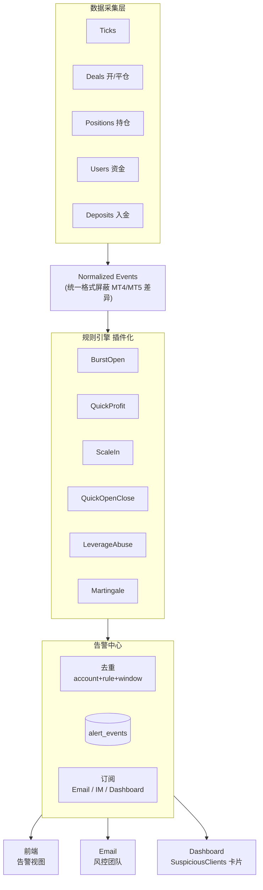

# Risk Monitor Roadmap — 中期架构升级与规则扩展备忘

> 本文档是 `/risk-monitor` 页面 **短期优化完成之后** 的迭代路线备忘录。
>
> **配套阅读**：
> - [risk-monitor.md](./risk-monitor.md) — 当前实现设计文档（Burst Open v2）
> - [.cursor/skills/risk-monitor/SKILL.md](../../.cursor/skills/risk-monitor/SKILL.md) — 精简版架构速查
>
> **状态**：2026-04-17 创建，存档短期优化（历史中心化）之后的后续规划。
>
> **更新历史**：
> - 2026-04-17 初建：中期架构、5 条新规则、实施路线、分级决策
> - 2026-04-17 追加：§7 CEN/USD 调研归档（暂缓实施）、§8 Profit 方案 C 归档（暂缓实施）、§9 MT4 vs MT5 命中数差异结论
> - 2026-04-17 §7 转为已实施（currency 列 + CEN ÷100）；§7.7 记录一次性回填脚本（9871 行）
> - 2026-04-17 新增 §10：zipcode enrichment + 后端 LIKE 模糊筛选上线
> - 2026-04-17 新增 §11：broker `OPEN_TIME` / `Time` 从 UTC+3 naive 转 UTC ISO8601（SQL 端 `CONVERT_TZ`），10142 行旧数据一次性回填

---

## 一、背景与定位

### 1.1 业务定位

KCM 是 B-Book CFD 券商，**客户盈利 = 公司亏损**。风控监控的目的不是保护客户，而是识别对公司 B-Book P&L 构成风险的高敞口客户。

### 1.2 当前已实现（截至短期优化后）

- **Burst Open Detection（批量下单检测）**：N 秒内同品种开 M 笔、每笔 ≥ K 手 → 标记可疑账户
- 后端驱动定时扫描（APScheduler，每 10min）
- 规则引擎（Python 滑动窗口）
- **告警事件级存储**（`alert_events` 表）+ 时间范围查询视图
- CSV 导出、日期范围自定义

### 1.3 当前架构缺口

| 维度 | 现状 | 缺口 |
|------|------|------|
| 规则数量 | 1 条（Burst Open） | 5+ 条新规则等待接入 |
| 数据采集 | 只拉 "最近 N 分钟开仓" | 需要平仓成交、持仓、资金、入金、合约表 |
| 规则接入 | 硬编码在 `scan_burst_open()` | 需要插件化（Strategy 模式） |
| 告警订阅 | 仅前端展示 | 无 Email / IM 主动通知 |
| 分级 | 全部统一 "可疑用户" | 新规则（Leverage Abuse, Martingale）需要分级 |

---

## 二、中期架构升级：从"快照扫描"到"风控告警中心"

### 2.1 目标架构



### 2.2 关键设计原则

**1. 数据采集层抽象**

每条规则声明自己的 `required_data_sources`，采集层按需查询并做增量缓存。例如：

```python
class QuickProfitStrategy(Strategy):
    required_data = [DataSource.RECENT_CLOSES, DataSource.RECENT_DEPOSITS]
    window = timedelta(minutes=30)
```

**2. 规则插件化**

每条规则 = 一个 `Strategy` 类，实现 `detect(events) -> list[Alert]`。新增规则只需：
1. 写一个类
2. 注册到 `STRATEGIES` 列表
3. 无需修改采集层、告警中心、前端

**3. 告警中心统一去重**

按 `(account, rule_id, time_bucket)` 做 key，1h 内同 key 不重发。避免同一账户被连续扫中时每 10min 发一次邮件。

**4. 事件流 vs 快照**

当前 `_latest_result` 模型是"体检快照"——最新扫描覆盖旧的。
升级后一切以 `alert_events` 为准，快照只作为"最近扫描的缓存"加速首屏渲染。

---

## 三、5 条新规则设计

> 以下阈值均为 Risk team 初始建议值，上线后观察 1-2 周真实数据再调整。

### 3.1 Rule A — Quick Profit（快速获利）

**风控含义**：短时间赚大钱 = 方向判断极准 / 信息优势 / 新闻套利 = B-Book 直接亏损源。

| 子规则 | 触发条件 | 数据源 |
|--------|---------|--------|
| A1 | 30min 内已实现 + 浮动利润 > $5,000 | 平仓成交 + 当前持仓 Profit |
| A2 | 24min 内利润 > 最近 30 天累计入金的 30% | 平仓成交 + fxbackoffice 入金记录 |

**实现难点**：
- "30min 滑动窗口" 必须实时（不只是"扫描时刻前 30min"）→ 需要跨扫描累积
- 入金数据在 `fxbackoffice` 库，需要复用 [backend/app/services/ib_data_service.py](../../backend/app/services/ib_data_service.py) 的连接

**扩展指标**（同事后续可能想要）：
- Profit / Equity 比率
- Profit / Total Open Lots（每手产生的利润）

### 3.2 Rule B — Scale-In Same Direction（频繁推仓/同向加仓）

**风控含义**：马丁的前兆形态——越跌越买、越涨越卖。和 Burst Open 的区别在于**方向一致 + 手数相近**。

| 条件 | 说明 |
|------|------|
| 同一 `(login, symbol, direction)` | 必须同方向 |
| 1 秒内 ≥ 3 单 | 时间窗口可配 |
| 每单 lot_size 相差 < 10% | `(max - min) / max < 10%` |

**实现复杂度**：Low。在 Burst Open 的分组里加一个 `direction` 维度和 lot_size 方差检查。

**SQL 起点**：复用 [docs/features/risk-monitor.md §9.3](./risk-monitor.md) 的"同秒开仓 ≥ N 笔" 粗筛 SQL，Python 端做方差检查。

### 3.3 Rule C — Quick Open-Close（快开快平）

**风控含义**：HFT / scalping 模式。单次风险小但命中率可怕，对 B-Book 毒性极高。

| 条件 | 说明 |
|------|------|
| 每张持仓时间 ≤ 60s | `close_time - open_time ≤ 60s` |
| 连续 ≥ 3 张 | 同一账户连续产生的订单都满足 ≤60s |

**数据源**：
- MT4：`mt4_trades WHERE CLOSE_TIME != '1970'` + 时间差计算
- MT5：`mt5_deals Entry=1/3` 通过 `PositionID` 关联 `Entry=0` 的开仓

SQL 模板参考 [docs/features/risk-monitor.md §9.5](./risk-monitor.md)（"完整交易生命周期"）。

### 3.4 Rule D — Leverage Abuse（滥用杠杆）

**风控含义**：B-Book 最核心风险指标。保证金用满 80-95% = MC 边缘的大敞口。

| 触发方式 | 条件 | 实现难度 |
|---------|------|---------|
| D1 瞬时超标 | 开仓后 `required_margin / equity > 95%` | Medium |
| D2 持续超标 | 连续 3 次扫描 `margin_ratio > 80%` | High（跨扫描状态机） |

**实现难点**：
- **合约规范差异**：XAU=100oz, EURUSD=100000, BTCUSD=1 等 → 需要品种合约表 `symbol_contract`
- **公式**：`required_margin = lots × contract_size × open_price / leverage`
- **equity 快照**：开仓瞬间的 equity 不可回溯 → 必须在扫描时刻捕获当下值并推算
- **连续 3 次** 需要跨扫描状态 → 建议在 SQLite 维护 `account_leverage_streak` 表

### 3.5 Rule E — Martingale（马丁策略）

**风控含义**：典型赌徒策略。一旦成功 = 公司亏损放大；破产前可能连续亏 5-10 单，最后一单回本 + 利润。

**判定逻辑**：

```
对同一 login, 按 close_time 排序已平仓订单:
  prev = 前一张
  curr = 当前订单
  if prev.profit < 0 AND curr.lots >= prev.lots × 1.5:
      连续计数 += 1
      if 连续计数 >= 3:
          触发 "马丁加仓"
      if curr.profit > |累计前几笔亏损| + 合理利润:
          额外标记 "回本 + 利润"（最强信号）
```

**实现难点**（**最高**）：
- 需要订单级历史序列 + 持仓状态
- 必须跨扫描累积 → 需要 `account_order_buffer` 表维护每个活跃账户最近 N 笔订单
- 回本判定需要计算 "累计亏损" → 不能只看单笔

---

## 四、分阶段实施路线

| Phase | 内容 | 前置 | 预估 |
|-------|------|------|------|
| **P1 已完成** | 历史中心化（事件级存储 + 时间范围视图） | - | 完成 |
| **P2 平台化** | 规则引擎 `Strategy` 模式，`scan()` 从硬编码 → 遍历注册的 strategies | P1 | 1-2 天 |
| **P3 易规则** | Scale-In（Rule B）+ Quick Open-Close（Rule C）+ 平仓数据采集 | P2 | 2-3 天 |
| **P4 资金规则** | Quick Profit（Rule A）+ Leverage Abuse（Rule D）+ 入金数据 + 品种合约表 | P3 | 3-5 天 |
| **P5 马丁** | Martingale（Rule E，跨扫描状态） + 订单 buffer 表 | P4 | 3-5 天 |
| **P6 订阅** | Email 告警（复用 [email_service.py](../../backend/app/services/email_service.py) + 去重）| P4 | 1-2 天 |
| **P7 看板** | Dashboard 组件 `SuspiciousClients.tsx`（命中次数 Top 10） | P1 | 1 天 |

---

## 五、分级（Severity）决策记录

**2026-04-17 决策**：前期（P1-P3）**不做分级**，与 Burst Open v2 保持一致。

**引入时机**：P4 启动 Leverage Abuse + Martingale 时，连同 P6 Email 订阅一起做。

**分级建议**（P4 时参考）：

| 规则 | 等级 |
|------|------|
| Leverage Abuse 单次 > 95% | Critical |
| Martingale 连续 3 次翻倍 | Critical |
| Quick Profit 30min > $5k | Warning |
| Leverage Abuse 连续 80% | Warning |
| Scale-In 1s 内 3 单同向 | Warning |
| Burst Open 批量下单 | Info |
| Quick Open-Close | Info |

**分级影响**：
- Email 订阅：仅 Critical 发邮件
- Dashboard 卡片：`3 个待处理 Critical` 醒目提示
- 前端默认筛选：默认只显示 Critical + Warning，Info 折叠
- 排序：Critical 自动排第一

---

## 六、数据源清单（P2+ 需要扩展的）

| 数据源 | 存储位置 | 当前使用？ | 用于规则 |
|--------|---------|-----------|---------|
| 最近 N 分钟开仓成交 | `mt4_trades OPEN_TIME`, `mt5_deals Entry=0` | 已用 | Burst, Scale-In, QuickOpen |
| 最近 N 分钟平仓成交 | `mt4_trades CLOSE_TIME != '1970'`, `mt5_deals Entry=1/3` | **待接入** | QuickProfit, QuickOpenClose, Martingale |
| 当前持仓 | `mt4_trades CLOSE_TIME='1970'`, `mt5_positions` | 部分用 | LeverageAbuse |
| 账户资金快照 | `mt4_users.EQUITY/MARGIN`, `mt5_users.Balance` | 查询时补 | 所有涉及资金比的规则 |
| 入金记录 | fxbackoffice 相关表 | **待确认** | QuickProfit A2 |
| 开仓瞬间保证金 | 计算 `lots × contract_size × price / leverage` | **待实现** | LeverageAbuse |
| 品种合约规范 | 建议新建 `symbol_contract` 表 | **待建表** | LeverageAbuse |
| 订单生命周期 buffer | 建议新建 `account_order_buffer` 表 | **待建表** | Martingale |

---

## 七、CEN / USD 账户处理（2026-04-17 已实施）

> **状态**：✅ 已实施。与同事沟通后确认 CEN 单位约定（equity/balance 除 100，lots 不变），落代码 + 前端加"币种"列。

### 7.1 问题

当前 `risk_monitor_service` 完全不区分 USD 账户和 CEN 账户，直接从 MT 服务器取 `EQUITY` / `BALANCE`。对 CEN 账户而言，这些值以**美分**为单位存储，所以前端展示的净值是真实美元的 **100 倍**。

影响范围：
- 净值、每手净值、equity_per_lot 全部偏大 100 倍
- 未来 Leverage Abuse 规则的保证金使用率判定会完全错
- 未来 Quick Profit 规则 profit 阈值会失效
- CSV 导出数据不可直接对账

**手数类字段（lots / order_count / total_open_lots）不受影响**，CEN 和 USD 合约规格一致。

### 7.2 CURRENCY 权威来源

**MT 服务器自己的 `mt4_users.CURRENCY` 不可信**——KCM 的 CEN 账户在 MT 服务器上 CURRENCY 通常写 `USD`，CRM 层额外记录 `CEN`。

**权威表**：`fxbackoffice.mt4_users`

| 列 | 说明 |
|---|---|
| `loginsid` | 格式 `{sid}-{login}`，例如 `5-67035933` |
| `sid` | 1 = MT4_Live · 5 = MT5 · 6 = MT4_Live2 · 2 = IB wallet（风控忽略） |
| `CURRENCY` | `USD` / `CEN` |
| `userId` | CRM 用户 ID（一人可有多 loginsid） |

**sid ↔ server label 映射**：
```python
SID_MAP = {"MT4_Live": 1, "MT4_Live2": 6, "MT5": 5}
```

同一个 userId 可以混合持有 USD 和 CEN 账户，样例（`userId=161443`）：
```
USD  2-908461     # IB wallet, 忽略
USD  5-39065820   # MT5 USD
CEN  5-67035933   # MT5 CEN
USD  2-9001747    # IB wallet, 忽略
CEN  5-67036541   # MT5 CEN
```

### 7.3 已实施方案

独立 enrichment 查询，不碰现有扫描 SQL。

在 `backend/app/services/risk_monitor_service.py` 里：

- `_SID_MAP = {"MT4_Live": 1, "MT4_Live2": 6, "MT5": 5}` —— server 到 fxbackoffice sid 的映射
- `_get_currency_map(conn, alerts)` —— 收集所有 alert 的 loginsid，一次查 `fxbackoffice.mt4_users`，返回 `{loginsid: 'USD' | 'CEN'}`。查询失败 / 记录缺失 → 默认 USD
- `_enrich_account_info` 中：在 MT4/MT5 原始 equity/balance 填充完之后、计算 `equity_per_lot` 之前，对 `CURRENCY='CEN'` 的 alert 把 `equity` 和 `balance` 除 100；`equity_per_lot` 因派生自 equity 自动正确
- alert 对象新增 `currency` 字段（`"USD" | "CEN"`）

数据库：

- `alert_events` 表新增 `currency TEXT` 列，`init_risk_monitor_db` 增加轻量迁移 `_migrate_alert_events_columns`（幂等 `ALTER TABLE ... ADD COLUMN`），旧数据库文件无需重建
- `append_scan_and_events` / `query_alert_events` / backfill 路径同步写入 / 读出 currency

Pydantic schemas：`BurstOpenAlert` 和 `AlertEvent` 新增 `currency: Optional[str] = None`。

### 7.4 已实施前端

- 列头 `净值(Equity)` → `净值 (USD)`、`每手净值` → `每手净值 (USD)`
- **新增"币种"列**（colId=`currency`）在账户列后、品种列前。CEN 用琥珀色高亮，USD 用淡灰
- CSV 导出自动带币种列（AG-Grid `allColumns` 默认行为）

### 7.5 约定与边界

- **lots 类字段不变**：`total_lots` / `order_count` / `total_open_lots` 在 CEN 和 USD 口径一致，合约规格相同
- **未知 currency 默认 USD**：查不到记录或字段为空时不做除法，避免把 USD 账户错误显示成 0.01 倍
- **sid=2（IB wallet）** 不参与风控，且 MT 服务器的 trading tables 里本就没这些账户，不会进入扫描流水

### 7.6 与 profit 方案 C 的耦合

未来实施方案 C（批量订单最终 profit 回溯）时，profit 的 CEN 除法规则和 currency map 要复用 `_get_currency_map`。建议将 currency 查询上提为 enrichment 公共步骤，profit-refresh 接口内部直接读 `alert_events.currency` 即可，不必重复查 fxbackoffice。

### 7.7 历史数据回填迁移（2026-04-17 执行）

`currency` 字段上线前 `alert_events` 已累计 9871 条旧行，这些行 `currency=NULL` 且 CEN 账户的 `equity` / `balance` 仍是美分原始值。写了一次性迁移脚本 `backend/scripts/backfill_alert_events_currency.py` 做统一修复。

**脚本设计**：

- 只扫 `WHERE currency IS NULL` 的行 → 幂等，重跑无害
- 默认 dry-run，`--apply` 才写
- 按 `_SID_MAP` 构造 loginsid 集 → 一次批量查 `fxbackoffice.mt4_users` → 建 `{loginsid: CURRENCY}` 字典
- CEN 行：`UPDATE currency='CEN', equity=equity/100, balance=balance/100, equity_per_lot=重算`
- USD 行：只 `UPDATE currency='USD'`，数值不动
- 未知 server 或 loginsid 查不到 → 默认 USD（保守不除 100）

**执行结果**：

| 项 | 数量 |
|----|------|
| 待处理行 | 9871 |
| 唯一 loginsid | 444 |
| fxbackoffice 命中率 | 444/444（100%） |
| CEN（÷100 + 打标） | 7424 |
| USD（仅打标） | 2447 |
| 缺失 / unknown server | 0 |

执行前 `cp risk_monitor.db risk_monitor.db.bak_20260417_160927` 备份（23M）。执行后抽检账户 67036965（CEN）：`equity 195818.0 → 1958.18`，符合预期。

**未来何时再用**：正常情况下新代码会把 currency 填好，脚本应为一次性。但若 currency 查询失败（MySQL 不可用）导致新增 NULL 行，可再跑一次补齐；幂等且不会对已标注 USD/CEN 的行做二次除法。

---

## 八、Profit 回溯展示（方案 C，暂缓实施）

> **状态**：方案确定（混合实时 + DB 缓存 + finalized 冻结），等 CEN 问题对齐后一起实施。

### 8.1 需求

风控人员希望看到"某批量下单最终是否盈利"——告警触发时订单尚未平仓，过几小时/几天后陆续平仓才有最终 profit。

### 8.2 核心难点

- 告警时 order 尚未 close，无 realized profit
- profit 随时间连续变化（浮动）
- 最终值依赖所有订单全部平仓
- 可能发生部分平仓
- CEN 账户 profit 同样需要除 100

### 8.3 当前数据缺口

`rule_burst_open_detect` 产出的 `orders` 里**缺 MT4 TICKET 和 MT5 PositionID**，无法回查订单。必须先补采集：
- MT4: `_query_mt4_recent_opens` SELECT 加 `t.TICKET AS ticket`
- MT5: `_query_mt5_recent_opens` 已有 `d.PositionID`，只要写进 `orders` 即可

落到 `alert_events.orders_json`，无需改表结构。

### 8.4 推荐方案 C（混合）

**DB 层**：`alert_events` 增加 3 列
```sql
ALTER TABLE alert_events ADD COLUMN batch_profit       REAL;
ALTER TABLE alert_events ADD COLUMN batch_profit_status TEXT;  -- open / partial / closed
ALTER TABLE alert_events ADD COLUMN profit_updated_at  TEXT;
```

**查询路径**：
1. 页面打开 → 拉 `alert_events` 列表（含已 finalized 的 profit）
2. 前端对 `status != 'closed'` 的行发 `POST /alerts/profit-refresh` 批量请求
3. 后端：
   - MT4 已平仓：`SELECT TICKET, PROFIT, SWAPS, COMMISSION FROM mt4_trades WHERE TICKET IN (...) AND CLOSE_TIME != '1970-01-01'`
   - MT4 未平仓：`SELECT TICKET, PROFIT, SWAPS FROM mt4_trades WHERE TICKET IN (...) AND CLOSE_TIME = '1970-01-01'`（浮动）
   - MT5 已平仓：`SELECT PositionID, SUM(Profit + Storage + Commission) FROM mt5_deals WHERE PositionID IN (...) AND Entry IN (1,3) GROUP BY PositionID`
   - MT5 未平仓：`SELECT Login, Profit + Storage FROM mt5_positions WHERE PositionID IN (...)`
4. CEN 转换（复用 §7.3 的 currency map）
5. 计算批量累计，判定 status；若 `status='closed'` 写 DB `batch_profit` 冻结

### 8.5 显示设计

| 批量 P&L (USD) | 状态 |
|---|---|
| `$+1,234.56` 🟢 | 持仓中 (实时) |
| `$+820.00` 🟢 | 部分平仓 |
| `$-430.12` 🔴 | 已平仓 ✓ |
| `—` | 查询中 / 失败 |

hover tooltip 展示每笔订单的 `ticket / 开仓价 / 平仓价 / profit`，便于排查。

### 8.6 分步实施路径

若想先上"够用"版本：

- **Day 1**：`orders_json` 补采集 `ticket` / `position_id`（准备工作，不显示）
- **Day 2**：`GET /alerts/profit-snapshot?ids=...` 只查已平仓订单的 realized profit，前端显示 `$XXX (已平仓)` 或 `持仓中`（不给数字）
- **Day 3+**：加浮动 profit、DB 冻结 finalized、tooltip 明细

---

## 九、MT4 vs MT5 检测数量差异调研（2026-04-17）

> **状态**：调研完成，找到 1 个确定的过滤差异 + 1 个业务解释，其他差异已排除。

### 9.1 现象

同事反馈 MT4 Live / MT4 Live2 命中数明显少于 MT5。

### 9.2 调查结论

**确定的 SQL 过滤差异**：

| 过滤项 | MT4 Live / MT4 Live2 | MT5 |
|---|---|---|
| demo/test | SQL 层 `GROUP NOT LIKE '%demo%' AND NOT LIKE '%test%'` | post-hoc 在 `_enrich_account_info` 过滤 |
| 账户号 | **`LOGIN NOT LIKE '7%'`**（已确认为测试账户段，正确过滤） | 无此过滤 |

**业务解释**（合理）：
- KCM 的 EA / 算法用户主要在 MT5（MQL4 已逐步被 MQL5 取代）
- "批量下单"特征本身在 MT5 就更常见
- 如果 CEN 账户集中在 MT5，而 CEN 多为高频小额用户，MT5 命中会更高

**其他差异已排除**：
- Volume 换算：MT4 `VOLUME/100` / MT5 `Volume/10000`，都准确换算到标准手
- Direction 映射：MT4 `CMD 0/1` / MT5 `Action 0/1`，语义一致
- 索引：MT4 用 `OPEN_TIME`，MT5 用 `Timestamp` (FILETIME)，都有索引
- Symbol 分组：MT5 常见 `.ecn/.pro` 后缀会把同用户的订单分散到不同组 —— 这只会**减少** MT5 命中而非增加，印证了"MT5 确实是高频用户集中地"这个业务解释

### 9.3 可疑但未验证的点

- **MT4 `OPEN_TIME` 时区**：MT4 库服务器时区和应用服务器时区若不一致，10min 窗口会对不上。可通过 `SELECT @@time_zone, NOW()` 在各 DB 上核对。目前没发现问题但值得长期监控。

### 9.4 决策

结论是 MT4 数量少属于**业务+既定过滤规则的合理结果**，不需要改动扫描逻辑。

---

## 十、Zipcode enrichment + 后端模糊筛选（2026-04-17 已实施）

> **状态**：✅ 已实施。同一客户多账户（同 zipcode）是批量下单检测后非常关键的二次信号，复用 §7 的 enrichment 通道，零额外 DB load 落地。

### 10.1 动机

Burst open 规则只看"同账户短时间多单"，但**同一自然人通过多个账户联动下单**会被拆分到不同 alert 行。风控同事需要一个维度把它们聚起来 —— 客户注册 zipcode 是最直接的信号（尤其越南的 "111 90" 这种大量复用的 zipcode）。

### 10.2 数据源

`fxbackoffice.mt4_users.ZIPCODE`，以 `loginsid = {sid}-{login}` 关联：

| server | sid |
|---|---|
| MT4_Live | 1 |
| MT4_Live2 | 6 |
| MT5 | 5 |

覆盖率：73,776 条账户中 2,903 条（~4%）为空。

### 10.3 后端实现

1. `_get_currency_map` 升级为 `_get_account_info_map`，**同一次 SQL 同时 SELECT CURRENCY + ZIPCODE** —— 不引入新查询
2. `alerts[i].zipcode` 随 `currency` 一起写入；空串归一化为 None
3. `alert_events` 表新增 `zipcode TEXT` 列，`_migrate_alert_events_columns` 加幂等 `ALTER TABLE`
4. `query_alert_events` / `alert_events_stats` 新增 `zipcode` 参数：
   ```sql
   AND zipcode LIKE ? ESCAPE '\\'   -- 参数: "%<input>%"
   ```
5. `_escape_like()` 把 `%` / `_` / `\\` 转义，防用户输入误通配
6. `GET /burst-open/alerts` + `/alerts/stats` 新增 `zipcode` query param（max 64 字符，空格归一化，空字符串 = 不筛）

### 10.4 前端实现

- `AlertEvent` 类型加 `zipcode: string | null`
- Toolbar 加独立输入框（服务器下拉右侧），**300ms debounce** 避免打字抖动
- 列顺序：服务器 → **Zipcode** → 账户 → 币种 → 品种 → ...
- NULL 值显示灰色 `—`；非 NULL 用 mono 字体
- `stats` 请求同步带 zipcode 参数 → 卡片数字与表格数字一致
- CSV 导出自动带该列

### 10.5 设计决策

| 决策 | 选择 | 理由 |
|---|---|---|
| 筛选位置 | 后端全局（不是 AG-Grid 前端列筛） | 跨页精确查；分页 1000 cap 也不会漏数据 |
| 匹配算法 | 简单 `LIKE '%x%'` 子串 | `"111" → "111 90"` 够用；不做去空格规则简化心智 |
| 空值策略 | NULL 永不命中 LIKE | CRM 未填 zipcode 的账户天然应被筛走 |
| 旧数据回填 | **不做** | 用户决策：旧 9888 行 zipcode 永远 NULL，只看新数据 |
| UI 位置 | Toolbar 独立输入框，不是列头筛 | 和"时间范围"、"服务器下拉"同层级，行为可预期 |

### 10.6 和后续 Profit 方案 C 的耦合

未来 Profit 方案 C 落地时，复用 `_get_account_info_map`（或直接读 `alert_events.currency` / `zipcode`），不必再查 fxbackoffice。

---

## 十一、Broker 时间 UTC 统一（2026-04-17 已实施）

### 11.1 问题

前端页面上同一行记录，"被发现时间" (`scanned_at`) 和 "具体时间（开仓）" (`first_open` / `last_open`) 差 3 小时，甚至出现 "开仓在被发现之前" 的反直觉画面。

根因链路：

| 字段 | 来源 | 时区 | 存储格式 |
|------|------|------|---------|
| `scanned_at` | Python `datetime.now(UTC).strftime(...Z)` | UTC | `2026-04-17T08:52:26Z` |
| `first_open` / `last_open` | MySQL `t.OPEN_TIME` / `d.Time` 直读 | broker local（UTC+3，Indian/Antananarivo，无 DST） | `2026-04-17 11:48:20`（naive） |

前端 `parseBackendTime`：naive 字符串会被打上 `Z` 当 UTC 解析，再按 HKT（UTC+8）渲染。结果 `first_open` 实际被 +6 小时（先被误当作 UTC，再从 UTC 转 HKT +8；正确逻辑应该是从 UTC+3 转 HKT 仅 +5），和正确 `scanned_at` 渲染对不齐。

### 11.2 方案 A（选定）：SQL 端 CONVERT_TZ

在 `_query_mt4_recent_opens` / `_query_mt5_recent_opens` 的 SELECT 子句里：

```sql
DATE_FORMAT(
    CONVERT_TZ(t.OPEN_TIME, '+03:00', '+00:00'),
    '%Y-%m-%dT%TZ'
) AS open_time
```

- **broker 时区写死 `'+03:00'`** —— 不依赖 `@@session.time_zone`（sudo / systemd 重启等路径不一定一致），broker 多年无 DST，写死更稳；`CONVERT_TZ` 使用字面 offset 也比查命名时区表快
- **WHERE 子句保持 `t.OPEN_TIME >= DATE_SUB(NOW(), ...)`** —— `t.OPEN_TIME` 和 `NOW()` 都是 broker local，比较仍正确，不必改
- **`DATE_FORMAT(..., '%Y-%m-%dT%TZ')`** —— 生成 `2026-04-17T08:48:20Z` 字面值，完全等同 Python 那边 `strftime` 出的格式；前端 `parseBackendTime` 已支持 `Z` 后缀，一次统一到底

### 11.3 历史数据回填

- 脚本：`backend/scripts/backfill_alert_events_open_time.py`
- 输入：`alert_events.first_open` / `last_open` + `orders_json[i].open_time`
- 逻辑：匹配 `^YYYY-MM-DD[T ]HH:MM:SS(\.\d+)?$` 这种 naive 串 → 减 3 小时 → 加 `Z`；已带 `Z` 或显式 offset 的值跳过（幂等）
- 执行结果（2026-04-17）：
  - `alert_events` 总行数 10165，回填 **10142 行**（8 行是 prod 重启前由 dev 容器用新代码写的，已经 Z 后缀）
  - `orders_json` 子数组里 **73960 笔 order.open_time** 一并修正
- 日后可再跑：脚本 idempotent，`--apply` 二次运行会打印 "Nothing to do"

### 11.4 为什么不同时修 `scanned_at`

`scanned_at` 一直是 Python `datetime.now(timezone.utc).strftime(...Z)` 生成，从来就是正确 UTC，无需改动。

### 11.5 未来相关动作

- 新增任何涉及 broker 时间字段（如 Rule C 的 `close_time`）时，**SQL SELECT 必须走同样的 `CONVERT_TZ('+03:00','+00:00')` + `DATE_FORMAT` 壳**，把"时区转换"内聚到 SQL 层，不要让 Python / 前端再做一次
- 若以后有多家 broker 加入且时区不同，再引入 `BROKER_TIMEZONE_MAP` 配置，而不是去查 `@@session.time_zone`

---

## 十二、引用文档

- [docs/features/risk-monitor.md](./risk-monitor.md) — 主设计文档（§9 探索 SQL、§10 Burst Open v2）
- [docs/ai-context/PROJECT_CONTEXT.md](../ai-context/PROJECT_CONTEXT.md) §4.8 — 项目全景
- [.cursor/skills/risk-monitor/SKILL.md](../../.cursor/skills/risk-monitor/SKILL.md) — 精简架构速查
- [.cursor/skills/email-notification/SKILL.md](../../.cursor/skills/email-notification/SKILL.md) — Email 订阅参考（P6 用）
