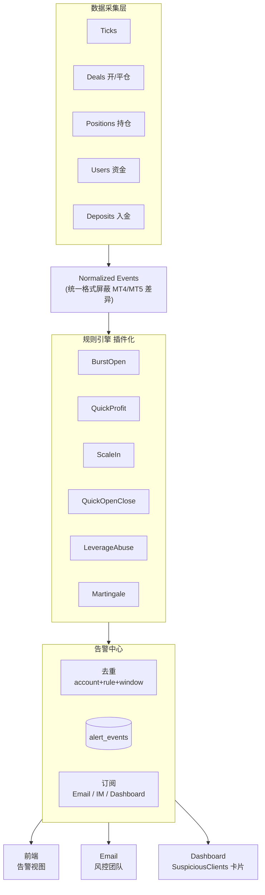

# Risk Monitor Roadmap — 中期架构升级与规则扩展备忘

> 本文档是 `/risk-monitor` 页面 **短期优化完成之后** 的迭代路线备忘录。
>
> **配套阅读**：
> - [risk-monitor.md](./risk-monitor.md) — 当前实现设计文档（Burst Open v2）
> - [.cursor/skills/risk-monitor/SKILL.md](../../.cursor/skills/risk-monitor/SKILL.md) — 精简版架构速查
>
> **状态**：2026-04-17 创建。2026-04-23 已实施章节（CEN、Zipcode、时区、MT4/MT5 差异）归档到 [risk-monitor-archive.md](./risk-monitor-archive.md)。
>
> **与主文档同步（2026-04-29）**：**快开快平（Rule C）核心检测 + 前端 Tab 已上线**——本节表格仍保留「规划中的扩展」（插件化、平仓采集增强等）。勿将本节 P3 文案理解为「快开快平完全未做」。

---

## 一、当前架构缺口

> Business context and current implementation: see `.cursor/skills/risk-monitor/SKILL.md`

| 维度 | 现状 | 缺口 |
|------|------|------|
| 规则数量 | 批量下单 + 快开快平 + 快速获利 + **Gap Trade（rule 71/81，2026-05-12 上线）** | 路线图中的 Scale-In / Martingale 等仍待接入 |
| 数据采集 | 只拉 "最近 N 分钟开仓" | 需要平仓成交、持仓、资金、入金、合约表 |
| 规则接入 | 硬编码在 `scan_burst_open()` | 需要插件化（Strategy 模式） |
| 告警订阅 | 仅前端展示 | 无 Email / IM 主动通知 |
| 分级 | 全部统一 "可疑用户" | 新规则（Leverage Abuse, Martingale）需要分级 |

---

## 二、中期架构升级：从"快照扫描"到"风控告警中心"

### 2.1 目标架构



### 2.2 关键设计原则

**1. 数据采集层抽象**

每条规则声明自己的 `required_data_sources`，采集层按需查询并做增量缓存。例如：

```python
class QuickProfitStrategy(Strategy):
    required_data = [DataSource.RECENT_CLOSES, DataSource.RECENT_DEPOSITS]
    window = timedelta(minutes=30)
```

**2. 规则插件化**

每条规则 = 一个 `Strategy` 类，实现 `detect(events) -> list[Alert]`。新增规则只需：
1. 写一个类
2. 注册到 `STRATEGIES` 列表
3. 无需修改采集层、告警中心、前端

**3. 告警中心统一去重**

按 `(account, rule_id, time_bucket)` 做 key，1h 内同 key 不重发。避免同一账户被连续扫中时每 10min 发一次邮件。

**4. 事件流 vs 快照**

当前 `_latest_result` 模型是"体检快照"——最新扫描覆盖旧的。
升级后一切以 `alert_events` 为准，快照只作为"最近扫描的缓存"加速首屏渲染。

---

## 三、5 条新规则设计

> 以下阈值均为 Risk team 初始建议值，上线后观察 1-2 周真实数据再调整。

### 3.1 Rule A — Quick Profit（快速获利）

> **实现状态（Phase 1，2026-05-07）**：A1 已上线 / Tab 3「快速获利」交付。
> A2「利润 > N% 入金」推迟到 Phase 2（当前已展示 1d/7d/30d 入金/出金列）。
> 详见 [risk-monitor.md §7](./risk-monitor.md)。

**风控含义**：短时间赚大钱 = 方向判断极准 / 信息优势 / 新闻套利 = B-Book 直接亏损源。

| 子规则 | 触发条件 | 数据源 | 状态 |
|--------|---------|--------|------|
| A1 | `lookback_min` 内已实现 + 可选浮动 ≥ `min_profit_usd` | 平仓成交 + 当前持仓 Profit | ✅ 上线（lookback 10-60 min 可配，阈值 $100 起） |
| A2 | 同窗口内利润 > 最近 30 天累计入金的 30% | A1 + fxbackoffice 入金记录 | ⏳ 推迟到 Phase 2（入金统计列已上线） |

**Phase 1 关键决策**：
- "30min 滑动窗口" 与 `scan_interval_min` **解耦**：SQL 拉 `max(rule.lookback_min) + 30s`，Python 切窗求和
- 浮动 P&L 通过独立轻量端点 `/quick-profit/floating-refresh` 由工具栏「刷新浮动盈亏」按钮按需触发（不重跑 scheduler，不自动轮询）
- 入金数据复用 [ib_data_service.py](../../backend/app/services/ib_data_service.py) 的 `fxbackoffice` 连接 + CEN 归一化模板
- Position status 三态（closed / open / mixed）由前端 `PositionStatusBadge` 三色 Badge 区分

**扩展指标**（同事后续可能想要）：
- Profit / Equity 比率
- Profit / Total Open Lots（每手产生的利润）

### 3.2 Rule B — Scale-In Same Direction（频繁推仓/同向加仓）

**风控含义**：马丁的前兆形态——越跌越买、越涨越卖。和 Burst Open 的区别在于**方向一致 + 手数相近**。

| 条件 | 说明 |
|------|------|
| 同一 `(login, symbol, direction)` | 必须同方向 |
| 1 秒内 ≥ 3 单 | 时间窗口可配 |
| 每单 lot_size 相差 < 10% | `(max - min) / max < 10%` |

**实现复杂度**：Low。在 Burst Open 的分组里加一个 `direction` 维度和 lot_size 方差检查。

**SQL 起点**：复用 [risk-monitor-archive.md](./risk-monitor-archive.md) §9.3 的"未平仓中同秒开仓 ≥ N 笔" 粗筛 SQL（已归档，不再出现在主文档），Python 端做方差检查。

### 3.3 Rule C — Quick Open-Close（快开快平）

> **实现状态**：检测、`alert_events` 持久化、`/quick-open-close/*` API 与 **RiskMonitor 第二 Tab** 已交付（详见 [risk-monitor.md](./risk-monitor.md)）。下表条件为产品设计摘要；参数化阈值以 SQLite 配置与前端抽屉为准。

**风控含义**：HFT / scalping 模式。单次风险小但命中率可怕，对 B-Book 毒性极高。

| 条件 | 说明 |
|------|------|
| 每张持仓时间 ≤ 60s | `close_time - open_time ≤ 60s` |
| 连续 ≥ 3 张 | 同一账户连续产生的订单都满足 ≤60s |

**数据源**：
- MT4：`mt4_trades WHERE CLOSE_TIME != '1970'` + 时间差计算
- MT5：`mt5_deals Entry=1/3` 通过 `PositionID` 关联 `Entry=0` 的开仓

SQL 模板参考 [risk-monitor-archive.md](./risk-monitor-archive.md) §9.5 "MT5 账户交易分析"（含完整交易生命周期 SQL，已归档）。

### 3.4 Rule D — Leverage Abuse（滥用杠杆）

**风控含义**：B-Book 最核心风险指标。保证金用满 80-95% = MC 边缘的大敞口。

| 触发方式 | 条件 | 实现难度 |
|---------|------|---------|
| D1 瞬时超标 | 开仓后 `required_margin / equity > 95%` | Medium |
| D2 持续超标 | 连续 3 次扫描 `margin_ratio > 80%` | High（跨扫描状态机） |

**实现难点**：
- **合约规范差异**：XAU=100oz, EURUSD=100000, BTCUSD=1 等 → 需要品种合约表 `symbol_contract`
- **公式**：`required_margin = lots × contract_size × open_price / leverage`
- **equity 快照**：开仓瞬间的 equity 不可回溯 → 必须在扫描时刻捕获当下值并推算
- **连续 3 次** 需要跨扫描状态 → 建议在 SQLite 维护 `account_leverage_streak` 表

### 3.5 Rule E — Martingale（马丁策略）

**风控含义**：典型赌徒策略。一旦成功 = 公司亏损放大；破产前可能连续亏 5-10 单，最后一单回本 + 利润。

**判定逻辑**：

```
对同一 login, 按 close_time 排序已平仓订单:
  prev = 前一张
  curr = 当前订单
  if prev.profit < 0 AND curr.lots >= prev.lots × 1.5:
      连续计数 += 1
      if 连续计数 >= 3:
          触发 "马丁加仓"
      if curr.profit > |累计前几笔亏损| + 合理利润:
          额外标记 "回本 + 利润"（最强信号）
```

**实现难点**（**最高**）：
- 需要订单级历史序列 + 持仓状态
- 必须跨扫描累积 → 需要 `account_order_buffer` 表维护每个活跃账户最近 N 笔订单
- 回本判定需要计算 "累计亏损" → 不能只看单笔

---

## 四、分阶段实施路线

| Phase | 内容 | 前置 | 预估 |
|-------|------|------|------|
| **P1 已完成** | 历史中心化（事件级存储 + 时间范围视图） | - | 完成 |
| **P2 平台化** | 规则引擎 `Strategy` 模式，`scan()` 从硬编码 → 遍历注册的 strategies | P1 | 1-2 天 |
| **P3 易规则** | Scale-In（Rule B）+ ~~Quick Open-Close（Rule C）~~ **（核心已上线，余量见 §3.3 注）** + 平仓数据采集增强 | P2 | 2-3 天 |
| **P4 资金规则** | ~~Quick Profit（Rule A1, Phase 1，2026-05-07 ✅）~~ + Quick Profit A2（待 Phase 2）+ Leverage Abuse（Rule D）+ 品种合约表 | P3 | A1 完成；其余 3-5 天 |
| **P5 马丁** | Martingale（Rule E，跨扫描状态） + 订单 buffer 表 | P4 | 3-5 天 |
| **P6 订阅** | Email 告警（复用 [email_service.py](../../backend/app/services/email_service.py) + 去重）| P4 | 1-2 天 |
| **P7 看板** | Dashboard 组件 `SuspiciousClients.tsx`（命中次数 Top 10） | P1 | 1 天 |

---

## 五、分级（Severity）决策记录

**2026-04-17 决策**：前期（P1-P3）**不做分级**，与 Burst Open v2 保持一致。

**引入时机**：P4 启动 Leverage Abuse + Martingale 时，连同 P6 Email 订阅一起做。

**分级建议**（P4 时参考）：

| 规则 | 等级 |
|------|------|
| Leverage Abuse 单次 > 95% | Critical |
| Martingale 连续 3 次翻倍 | Critical |
| Quick Profit 30min > $5k | Warning |
| Leverage Abuse 连续 80% | Warning |
| Scale-In 1s 内 3 单同向 | Warning |
| Burst Open 批量下单 | Info |
| Quick Open-Close | Info |

**分级影响**：
- Email 订阅：仅 Critical 发邮件
- Dashboard 卡片：`3 个待处理 Critical` 醒目提示
- 前端默认筛选：默认只显示 Critical + Warning，Info 折叠
- 排序：Critical 自动排第一

---

## 六、数据源清单（P2+ 需要扩展的）

| 数据源 | 存储位置 | 当前使用？ | 用于规则 |
|--------|---------|-----------|---------|
| 最近 N 分钟开仓成交 | `mt4_trades OPEN_TIME`, `mt5_deals Entry=0` | 已用 | Burst, Scale-In, QuickOpen |
| 最近 N 分钟平仓成交 | `mt4_trades CLOSE_TIME != '1970'`, `mt5_deals Entry=1/3` | **待接入** | QuickProfit, QuickOpenClose, Martingale |
| 当前持仓 | `mt4_trades CLOSE_TIME='1970'`, `mt5_positions` | 部分用 | LeverageAbuse |
| 账户资金快照 | `mt4_users.EQUITY/MARGIN`, `mt5_users.Balance` | 查询时补 | 所有涉及资金比的规则 |
| 入金记录 | fxbackoffice 相关表 | **待确认** | QuickProfit A2 |
| 开仓瞬间保证金 | 计算 `lots × contract_size × price / leverage` | **待实现** | LeverageAbuse |
| 品种合约规范 | 建议新建 `symbol_contract` 表 | **待建表** | LeverageAbuse |
| 订单生命周期 buffer | 建议新建 `account_order_buffer` 表 | **待建表** | Martingale |

---

## 七、Profit 回溯展示（方案 C，暂缓实施）

> **状态**：方案确定（混合实时 + DB 缓存 + finalized 冻结），等 CEN 问题对齐后一起实施。

### 8.1 需求

风控人员希望看到"某批量下单最终是否盈利"——告警触发时订单尚未平仓，过几小时/几天后陆续平仓才有最终 profit。

### 8.2 核心难点

- 告警时 order 尚未 close，无 realized profit
- profit 随时间连续变化（浮动）
- 最终值依赖所有订单全部平仓
- 可能发生部分平仓
- CEN 账户 profit 同样需要除 100

### 8.3 当前数据缺口

`rule_burst_open_detect` 产出的 `orders` 里**缺 MT4 TICKET 和 MT5 PositionID**，无法回查订单。必须先补采集：
- MT4: `_query_mt4_recent_opens` SELECT 加 `t.TICKET AS ticket`
- MT5: `_query_mt5_recent_opens` 已有 `d.PositionID`，只要写进 `orders` 即可

落到 `alert_events.orders_json`，无需改表结构。

### 8.4 推荐方案 C（混合）

**DB 层**：`alert_events` 增加 3 列
```sql
ALTER TABLE alert_events ADD COLUMN batch_profit       REAL;
ALTER TABLE alert_events ADD COLUMN batch_profit_status TEXT;  -- open / partial / closed
ALTER TABLE alert_events ADD COLUMN profit_updated_at  TEXT;
```

**查询路径**：
1. 页面打开 → 拉 `alert_events` 列表（含已 finalized 的 profit）
2. 前端对 `status != 'closed'` 的行发 `POST /alerts/profit-refresh` 批量请求
3. 后端：
   - MT4 已平仓：`SELECT TICKET, PROFIT, SWAPS, COMMISSION FROM mt4_trades WHERE TICKET IN (...) AND CLOSE_TIME != '1970-01-01'`
   - MT4 未平仓：`SELECT TICKET, PROFIT, SWAPS FROM mt4_trades WHERE TICKET IN (...) AND CLOSE_TIME = '1970-01-01'`（浮动）
   - MT5 已平仓：`SELECT PositionID, SUM(Profit + Storage + Commission) FROM mt5_deals WHERE PositionID IN (...) AND Entry IN (1,3) GROUP BY PositionID`
   - MT5 未平仓：`SELECT Login, Profit + Storage FROM mt5_positions WHERE PositionID IN (...)`
4. CEN 转换（复用 §7.3 的 currency map）
5. 计算批量累计，判定 status；若 `status='closed'` 写 DB `batch_profit` 冻结

### 8.5 显示设计

| 批量 P&L (USD) | 状态 |
|---|---|
| `$+1,234.56` 🟢 | 持仓中 (实时) |
| `$+820.00` 🟢 | 部分平仓 |
| `$-430.12` 🔴 | 已平仓 ✓ |
| `—` | 查询中 / 失败 |

hover tooltip 展示每笔订单的 `ticket / 开仓价 / 平仓价 / profit`，便于排查。

### 8.6 分步实施路径

若想先上"够用"版本：

- **Day 1**：`orders_json` 补采集 `ticket` / `position_id`（准备工作，不显示）
- **Day 2**：`GET /alerts/profit-snapshot?ids=...` 只查已平仓订单的 realized profit，前端显示 `$XXX (已平仓)` 或 `持仓中`（不给数字）
- **Day 3+**：加浮动 profit、DB 冻结 finalized、tooltip 明细

---

## 八、引用文档

- [docs/features/risk-monitor.md](./risk-monitor.md) — 主设计文档（§6 Burst Open v2）
- [docs/features/risk-monitor-archive.md](./risk-monitor-archive.md) — 已实施/历史归档（CEN、Zipcode、时区、探索 SQL 等）
- [docs/features/risk-monitor-reusable-patterns.md](./risk-monitor-reusable-patterns.md) — 可复用代码模板
- [.cursor/skills/risk-monitor/SKILL.md](../../.cursor/skills/risk-monitor/SKILL.md) — 精简架构速查 + 新规则脚手架
- [.cursor/skills/email-notification/SKILL.md](../../.cursor/skills/email-notification/SKILL.md) — Email 订阅参考
