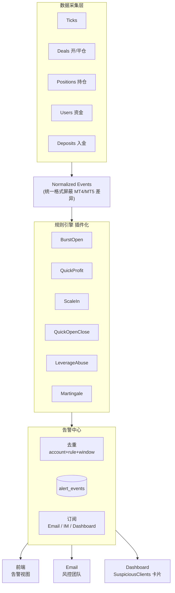

# Risk Monitor Roadmap — 中期架构升级与规则扩展备忘

> 本文档是 `/risk-monitor` 页面 **短期优化完成之后** 的迭代路线备忘录。
>
> **配套阅读**：
> - [risk-monitor.md](./risk-monitor.md) — 当前实现设计文档（Burst Open v2）
> - [.cursor/skills/risk-monitor/SKILL.md](../../.cursor/skills/risk-monitor/SKILL.md) — 精简版架构速查
>
> **状态**：2026-04-17 创建，存档短期优化（历史中心化）之后的后续规划。
>
> **更新历史**：
> - 2026-04-17 初建：中期架构、5 条新规则、实施路线、分级决策
> - 2026-04-17 追加：§7 CEN/USD 调研归档（暂缓实施）、§8 Profit 方案 C 归档（暂缓实施）、§9 MT4 vs MT5 命中数差异结论

---

## 一、背景与定位

### 1.1 业务定位

KCM 是 B-Book CFD 券商，**客户盈利 = 公司亏损**。风控监控的目的不是保护客户，而是识别对公司 B-Book P&L 构成风险的高敞口客户。

### 1.2 当前已实现（截至短期优化后）

- **Burst Open Detection（批量下单检测）**：N 秒内同品种开 M 笔、每笔 ≥ K 手 → 标记可疑账户
- 后端驱动定时扫描（APScheduler，每 10min）
- 规则引擎（Python 滑动窗口）
- **告警事件级存储**（`alert_events` 表）+ 时间范围查询视图
- CSV 导出、日期范围自定义

### 1.3 当前架构缺口

| 维度 | 现状 | 缺口 |
|------|------|------|
| 规则数量 | 1 条（Burst Open） | 5+ 条新规则等待接入 |
| 数据采集 | 只拉 "最近 N 分钟开仓" | 需要平仓成交、持仓、资金、入金、合约表 |
| 规则接入 | 硬编码在 `scan_burst_open()` | 需要插件化（Strategy 模式） |
| 告警订阅 | 仅前端展示 | 无 Email / IM 主动通知 |
| 分级 | 全部统一 "可疑用户" | 新规则（Leverage Abuse, Martingale）需要分级 |

---

## 二、中期架构升级：从"快照扫描"到"风控告警中心"

### 2.1 目标架构



### 2.2 关键设计原则

**1. 数据采集层抽象**

每条规则声明自己的 `required_data_sources`，采集层按需查询并做增量缓存。例如：

```python
class QuickProfitStrategy(Strategy):
    required_data = [DataSource.RECENT_CLOSES, DataSource.RECENT_DEPOSITS]
    window = timedelta(minutes=30)
```

**2. 规则插件化**

每条规则 = 一个 `Strategy` 类，实现 `detect(events) -> list[Alert]`。新增规则只需：
1. 写一个类
2. 注册到 `STRATEGIES` 列表
3. 无需修改采集层、告警中心、前端

**3. 告警中心统一去重**

按 `(account, rule_id, time_bucket)` 做 key，1h 内同 key 不重发。避免同一账户被连续扫中时每 10min 发一次邮件。

**4. 事件流 vs 快照**

当前 `_latest_result` 模型是"体检快照"——最新扫描覆盖旧的。
升级后一切以 `alert_events` 为准，快照只作为"最近扫描的缓存"加速首屏渲染。

---

## 三、5 条新规则设计

> 以下阈值均为 Risk team 初始建议值，上线后观察 1-2 周真实数据再调整。

### 3.1 Rule A — Quick Profit（快速获利）

**风控含义**：短时间赚大钱 = 方向判断极准 / 信息优势 / 新闻套利 = B-Book 直接亏损源。

| 子规则 | 触发条件 | 数据源 |
|--------|---------|--------|
| A1 | 30min 内已实现 + 浮动利润 > $5,000 | 平仓成交 + 当前持仓 Profit |
| A2 | 24min 内利润 > 最近 30 天累计入金的 30% | 平仓成交 + fxbackoffice 入金记录 |

**实现难点**：
- "30min 滑动窗口" 必须实时（不只是"扫描时刻前 30min"）→ 需要跨扫描累积
- 入金数据在 `fxbackoffice` 库，需要复用 [backend/app/services/ib_data_service.py](../../backend/app/services/ib_data_service.py) 的连接

**扩展指标**（同事后续可能想要）：
- Profit / Equity 比率
- Profit / Total Open Lots（每手产生的利润）

### 3.2 Rule B — Scale-In Same Direction（频繁推仓/同向加仓）

**风控含义**：马丁的前兆形态——越跌越买、越涨越卖。和 Burst Open 的区别在于**方向一致 + 手数相近**。

| 条件 | 说明 |
|------|------|
| 同一 `(login, symbol, direction)` | 必须同方向 |
| 1 秒内 ≥ 3 单 | 时间窗口可配 |
| 每单 lot_size 相差 < 10% | `(max - min) / max < 10%` |

**实现复杂度**：Low。在 Burst Open 的分组里加一个 `direction` 维度和 lot_size 方差检查。

**SQL 起点**：复用 [docs/features/risk-monitor.md §9.3](./risk-monitor.md) 的"同秒开仓 ≥ N 笔" 粗筛 SQL，Python 端做方差检查。

### 3.3 Rule C — Quick Open-Close（快开快平）

**风控含义**：HFT / scalping 模式。单次风险小但命中率可怕，对 B-Book 毒性极高。

| 条件 | 说明 |
|------|------|
| 每张持仓时间 ≤ 60s | `close_time - open_time ≤ 60s` |
| 连续 ≥ 3 张 | 同一账户连续产生的订单都满足 ≤60s |

**数据源**：
- MT4：`mt4_trades WHERE CLOSE_TIME != '1970'` + 时间差计算
- MT5：`mt5_deals Entry=1/3` 通过 `PositionID` 关联 `Entry=0` 的开仓

SQL 模板参考 [docs/features/risk-monitor.md §9.5](./risk-monitor.md)（"完整交易生命周期"）。

### 3.4 Rule D — Leverage Abuse（滥用杠杆）

**风控含义**：B-Book 最核心风险指标。保证金用满 80-95% = MC 边缘的大敞口。

| 触发方式 | 条件 | 实现难度 |
|---------|------|---------|
| D1 瞬时超标 | 开仓后 `required_margin / equity > 95%` | Medium |
| D2 持续超标 | 连续 3 次扫描 `margin_ratio > 80%` | High（跨扫描状态机） |

**实现难点**：
- **合约规范差异**：XAU=100oz, EURUSD=100000, BTCUSD=1 等 → 需要品种合约表 `symbol_contract`
- **公式**：`required_margin = lots × contract_size × open_price / leverage`
- **equity 快照**：开仓瞬间的 equity 不可回溯 → 必须在扫描时刻捕获当下值并推算
- **连续 3 次** 需要跨扫描状态 → 建议在 SQLite 维护 `account_leverage_streak` 表

### 3.5 Rule E — Martingale（马丁策略）

**风控含义**：典型赌徒策略。一旦成功 = 公司亏损放大；破产前可能连续亏 5-10 单，最后一单回本 + 利润。

**判定逻辑**：

```
对同一 login, 按 close_time 排序已平仓订单:
  prev = 前一张
  curr = 当前订单
  if prev.profit < 0 AND curr.lots >= prev.lots × 1.5:
      连续计数 += 1
      if 连续计数 >= 3:
          触发 "马丁加仓"
      if curr.profit > |累计前几笔亏损| + 合理利润:
          额外标记 "回本 + 利润"（最强信号）
```

**实现难点**（**最高**）：
- 需要订单级历史序列 + 持仓状态
- 必须跨扫描累积 → 需要 `account_order_buffer` 表维护每个活跃账户最近 N 笔订单
- 回本判定需要计算 "累计亏损" → 不能只看单笔

---

## 四、分阶段实施路线

| Phase | 内容 | 前置 | 预估 |
|-------|------|------|------|
| **P1 已完成** | 历史中心化（事件级存储 + 时间范围视图） | - | 完成 |
| **P2 平台化** | 规则引擎 `Strategy` 模式，`scan()` 从硬编码 → 遍历注册的 strategies | P1 | 1-2 天 |
| **P3 易规则** | Scale-In（Rule B）+ Quick Open-Close（Rule C）+ 平仓数据采集 | P2 | 2-3 天 |
| **P4 资金规则** | Quick Profit（Rule A）+ Leverage Abuse（Rule D）+ 入金数据 + 品种合约表 | P3 | 3-5 天 |
| **P5 马丁** | Martingale（Rule E，跨扫描状态） + 订单 buffer 表 | P4 | 3-5 天 |
| **P6 订阅** | Email 告警（复用 [email_service.py](../../backend/app/services/email_service.py) + 去重）| P4 | 1-2 天 |
| **P7 看板** | Dashboard 组件 `SuspiciousClients.tsx`（命中次数 Top 10） | P1 | 1 天 |

---

## 五、分级（Severity）决策记录

**2026-04-17 决策**：前期（P1-P3）**不做分级**，与 Burst Open v2 保持一致。

**引入时机**：P4 启动 Leverage Abuse + Martingale 时，连同 P6 Email 订阅一起做。

**分级建议**（P4 时参考）：

| 规则 | 等级 |
|------|------|
| Leverage Abuse 单次 > 95% | Critical |
| Martingale 连续 3 次翻倍 | Critical |
| Quick Profit 30min > $5k | Warning |
| Leverage Abuse 连续 80% | Warning |
| Scale-In 1s 内 3 单同向 | Warning |
| Burst Open 批量下单 | Info |
| Quick Open-Close | Info |

**分级影响**：
- Email 订阅：仅 Critical 发邮件
- Dashboard 卡片：`3 个待处理 Critical` 醒目提示
- 前端默认筛选：默认只显示 Critical + Warning，Info 折叠
- 排序：Critical 自动排第一

---

## 六、数据源清单（P2+ 需要扩展的）

| 数据源 | 存储位置 | 当前使用？ | 用于规则 |
|--------|---------|-----------|---------|
| 最近 N 分钟开仓成交 | `mt4_trades OPEN_TIME`, `mt5_deals Entry=0` | 已用 | Burst, Scale-In, QuickOpen |
| 最近 N 分钟平仓成交 | `mt4_trades CLOSE_TIME != '1970'`, `mt5_deals Entry=1/3` | **待接入** | QuickProfit, QuickOpenClose, Martingale |
| 当前持仓 | `mt4_trades CLOSE_TIME='1970'`, `mt5_positions` | 部分用 | LeverageAbuse |
| 账户资金快照 | `mt4_users.EQUITY/MARGIN`, `mt5_users.Balance` | 查询时补 | 所有涉及资金比的规则 |
| 入金记录 | fxbackoffice 相关表 | **待确认** | QuickProfit A2 |
| 开仓瞬间保证金 | 计算 `lots × contract_size × price / leverage` | **待实现** | LeverageAbuse |
| 品种合约规范 | 建议新建 `symbol_contract` 表 | **待建表** | LeverageAbuse |
| 订单生命周期 buffer | 建议新建 `account_order_buffer` 表 | **待建表** | Martingale |

---

## 七、CEN / USD 账户处理（2026-04-17 调研，暂缓实施）

> **状态**：调研完成，确认是历史遗留问题。**决定暂不实施**（需先与同事对齐 CEN 单位约定），调研结论归档于此作为未来实施的参考。

### 7.1 问题

当前 `risk_monitor_service` 完全不区分 USD 账户和 CEN 账户，直接从 MT 服务器取 `EQUITY` / `BALANCE`。对 CEN 账户而言，这些值以**美分**为单位存储，所以前端展示的净值是真实美元的 **100 倍**。

影响范围：
- 净值、每手净值、equity_per_lot 全部偏大 100 倍
- 未来 Leverage Abuse 规则的保证金使用率判定会完全错
- 未来 Quick Profit 规则 profit 阈值会失效
- CSV 导出数据不可直接对账

**手数类字段（lots / order_count / total_open_lots）不受影响**，CEN 和 USD 合约规格一致。

### 7.2 CURRENCY 权威来源

**MT 服务器自己的 `mt4_users.CURRENCY` 不可信**——KCM 的 CEN 账户在 MT 服务器上 CURRENCY 通常写 `USD`，CRM 层额外记录 `CEN`。

**权威表**：`fxbackoffice.mt4_users`

| 列 | 说明 |
|---|---|
| `loginsid` | 格式 `{sid}-{login}`，例如 `5-67035933` |
| `sid` | 1 = MT4_Live · 5 = MT5 · 6 = MT4_Live2 · 2 = IB wallet（风控忽略） |
| `CURRENCY` | `USD` / `CEN` |
| `userId` | CRM 用户 ID（一人可有多 loginsid） |

**sid ↔ server label 映射**：
```python
SID_MAP = {"MT4_Live": 1, "MT4_Live2": 6, "MT5": 5}
```

同一个 userId 可以混合持有 USD 和 CEN 账户，样例（`userId=161443`）：
```
USD  2-908461     # IB wallet, 忽略
USD  5-39065820   # MT5 USD
CEN  5-67035933   # MT5 CEN
USD  2-9001747    # IB wallet, 忽略
CEN  5-67036541   # MT5 CEN
```

### 7.3 实施方案（未来用）

**推荐方案**：独立 enrichment 查询，不碰现有扫描 SQL。

在 `_enrich_account_info` 里加一步：收集所有 alert 的 `(server, login)` → 组 loginsid 列表 → 一次查 `fxbackoffice.mt4_users` → 建 `loginsid → CURRENCY` 字典 → 对 `CURRENCY='CEN'` 的 alert 把 `equity` / `balance` ÷ 100，`equity_per_lot` 因派生自 equity 自动正确。

```python
# 伪代码
loginsids = [f"{SID_MAP[a['server']]}-{a['login']}" for a in alerts]
currency_map = query_currency(loginsids)  # fxbackoffice.mt4_users
for a in alerts:
    key = f"{SID_MAP[a['server']]}-{a['login']}"
    if currency_map.get(key) == "CEN":
        if a["equity"] is not None:  a["equity"]  /= 100
        if a["balance"] is not None: a["balance"] /= 100
        a["currency"] = "CEN"
    else:
        a["currency"] = currency_map.get(key, "USD")  # 查不到默认 USD
```

**不选 JOIN 方案**的原因：扫描阶段保持窄而快，enrichment 阶段统一补齐，架构清晰。

### 7.4 前端配合（未来用）

- 列头 `净值` → `净值 (USD)`、`每手净值` → `每手净值 (USD)`
- **新增"币种"列**展示 `USD` / `CEN`（CEN 账户行为特征和 USD 不同，风控人员需要此上下文）
- CSV 导出同步带币种列

### 7.5 实施前必须和同事确认的 5 件事

- [ ] **CURRENCY 覆盖率**：`SELECT CURRENCY, COUNT(*) FROM fxbackoffice.mt4_users WHERE sid IN (1,5,6) GROUP BY CURRENCY;` 值域是否只有 `{USD, CEN}`、是否有 NULL
- [ ] **equity / balance 美分约定**：`mt4_live.mt4_users.EQUITY` / `mt5_live.mt5_users.Balance` 对 CEN 账户是否都是美分单位
- [ ] **profit 美分约定**：`mt4_trades.PROFIT` / `mt5_deals.Profit` 对 CEN 账户是否都是美分单位（方案 C profit 展示会用到）
- [ ] **lot 合约规格**：CEN 账户 1 手是否和 USD 账户等同（1 手 EURUSD = 100k base），还是 mini lot
- [ ] **UI 决策**：要不要加"币种"列（方案 a：只改列头；方案 b：改列头 + 加币种列 —— 推荐 b）

### 7.6 与 profit 方案 C 的耦合

未来若实施方案 C（批量订单最终 profit 回溯），profit 的 CEN 除法规则和 currency map 要复用同一份 `loginsid → CURRENCY` 字典。因此两项功能适合一起实施，避免重复查 `fxbackoffice.mt4_users`。

---

## 八、Profit 回溯展示（方案 C，暂缓实施）

> **状态**：方案确定（混合实时 + DB 缓存 + finalized 冻结），等 CEN 问题对齐后一起实施。

### 8.1 需求

风控人员希望看到"某批量下单最终是否盈利"——告警触发时订单尚未平仓，过几小时/几天后陆续平仓才有最终 profit。

### 8.2 核心难点

- 告警时 order 尚未 close，无 realized profit
- profit 随时间连续变化（浮动）
- 最终值依赖所有订单全部平仓
- 可能发生部分平仓
- CEN 账户 profit 同样需要除 100

### 8.3 当前数据缺口

`rule_burst_open_detect` 产出的 `orders` 里**缺 MT4 TICKET 和 MT5 PositionID**，无法回查订单。必须先补采集：
- MT4: `_query_mt4_recent_opens` SELECT 加 `t.TICKET AS ticket`
- MT5: `_query_mt5_recent_opens` 已有 `d.PositionID`，只要写进 `orders` 即可

落到 `alert_events.orders_json`，无需改表结构。

### 8.4 推荐方案 C（混合）

**DB 层**：`alert_events` 增加 3 列
```sql
ALTER TABLE alert_events ADD COLUMN batch_profit       REAL;
ALTER TABLE alert_events ADD COLUMN batch_profit_status TEXT;  -- open / partial / closed
ALTER TABLE alert_events ADD COLUMN profit_updated_at  TEXT;
```

**查询路径**：
1. 页面打开 → 拉 `alert_events` 列表（含已 finalized 的 profit）
2. 前端对 `status != 'closed'` 的行发 `POST /alerts/profit-refresh` 批量请求
3. 后端：
   - MT4 已平仓：`SELECT TICKET, PROFIT, SWAPS, COMMISSION FROM mt4_trades WHERE TICKET IN (...) AND CLOSE_TIME != '1970-01-01'`
   - MT4 未平仓：`SELECT TICKET, PROFIT, SWAPS FROM mt4_trades WHERE TICKET IN (...) AND CLOSE_TIME = '1970-01-01'`（浮动）
   - MT5 已平仓：`SELECT PositionID, SUM(Profit + Storage + Commission) FROM mt5_deals WHERE PositionID IN (...) AND Entry IN (1,3) GROUP BY PositionID`
   - MT5 未平仓：`SELECT Login, Profit + Storage FROM mt5_positions WHERE PositionID IN (...)`
4. CEN 转换（复用 §7.3 的 currency map）
5. 计算批量累计，判定 status；若 `status='closed'` 写 DB `batch_profit` 冻结

### 8.5 显示设计

| 批量 P&L (USD) | 状态 |
|---|---|
| `$+1,234.56` 🟢 | 持仓中 (实时) |
| `$+820.00` 🟢 | 部分平仓 |
| `$-430.12` 🔴 | 已平仓 ✓ |
| `—` | 查询中 / 失败 |

hover tooltip 展示每笔订单的 `ticket / 开仓价 / 平仓价 / profit`，便于排查。

### 8.6 分步实施路径

若想先上"够用"版本：

- **Day 1**：`orders_json` 补采集 `ticket` / `position_id`（准备工作，不显示）
- **Day 2**：`GET /alerts/profit-snapshot?ids=...` 只查已平仓订单的 realized profit，前端显示 `$XXX (已平仓)` 或 `持仓中`（不给数字）
- **Day 3+**：加浮动 profit、DB 冻结 finalized、tooltip 明细

---

## 九、MT4 vs MT5 检测数量差异调研（2026-04-17）

> **状态**：调研完成，找到 1 个确定的过滤差异 + 1 个业务解释，其他差异已排除。

### 9.1 现象

同事反馈 MT4 Live / MT4 Live2 命中数明显少于 MT5。

### 9.2 调查结论

**确定的 SQL 过滤差异**：

| 过滤项 | MT4 Live / MT4 Live2 | MT5 |
|---|---|---|
| demo/test | SQL 层 `GROUP NOT LIKE '%demo%' AND NOT LIKE '%test%'` | post-hoc 在 `_enrich_account_info` 过滤 |
| 账户号 | **`LOGIN NOT LIKE '7%'`**（已确认为测试账户段，正确过滤） | 无此过滤 |

**业务解释**（合理）：
- KCM 的 EA / 算法用户主要在 MT5（MQL4 已逐步被 MQL5 取代）
- "批量下单"特征本身在 MT5 就更常见
- 如果 CEN 账户集中在 MT5，而 CEN 多为高频小额用户，MT5 命中会更高

**其他差异已排除**：
- Volume 换算：MT4 `VOLUME/100` / MT5 `Volume/10000`，都准确换算到标准手
- Direction 映射：MT4 `CMD 0/1` / MT5 `Action 0/1`，语义一致
- 索引：MT4 用 `OPEN_TIME`，MT5 用 `Timestamp` (FILETIME)，都有索引
- Symbol 分组：MT5 常见 `.ecn/.pro` 后缀会把同用户的订单分散到不同组 —— 这只会**减少** MT5 命中而非增加，印证了"MT5 确实是高频用户集中地"这个业务解释

### 9.3 可疑但未验证的点

- **MT4 `OPEN_TIME` 时区**：MT4 库服务器时区和应用服务器时区若不一致，10min 窗口会对不上。可通过 `SELECT @@time_zone, NOW()` 在各 DB 上核对。目前没发现问题但值得长期监控。

### 9.4 决策

结论是 MT4 数量少属于**业务+既定过滤规则的合理结果**，不需要改动扫描逻辑。

---

## 十、引用文档

- [docs/features/risk-monitor.md](./risk-monitor.md) — 主设计文档（§9 探索 SQL、§10 Burst Open v2）
- [docs/ai-context/PROJECT_CONTEXT.md](../ai-context/PROJECT_CONTEXT.md) §4.8 — 项目全景
- [.cursor/skills/risk-monitor/SKILL.md](../../.cursor/skills/risk-monitor/SKILL.md) — 精简架构速查
- [.cursor/skills/email-notification/SKILL.md](../../.cursor/skills/email-notification/SKILL.md) — Email 订阅参考（P6 用）
