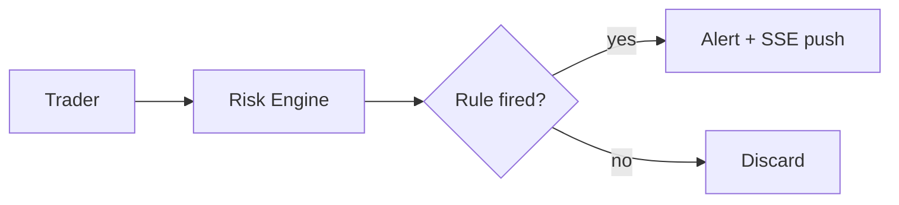

# 文档中心 / Docs Portal — 运维与开发指南

> 入口：sidebar `Configuration → 文档中心` 或直接 `https://analysis.kohleservices.com/docs/`（生产）/ `http://10.6.20.138:3000/docs/`（容器直连）。
> OPT 来源：[`docs/optimization/items/OPT-0026-docs-portal.md`](../optimization/items/OPT-0026-docs-portal.md)。

## 1. 架构一图

```
┌───────────────────┐    Cloudflare    ┌─────────────────┐
│ iPad / 手机浏览器 │ ─── Tunnel ────▶ │ Nginx (web 容器) │
└───────────────────┘                  └──────┬──────────┘
                                              │ /docs/* → proxy_pass
                                              │ http://mkdocs:8000/
                                              ▼
                                       ┌──────────────────┐
                                       │ mkdocs container │
                                       │ (mkdocs serve)   │
                                       │  ↑ 挂载 ./docs/  │
                                       │  ↑ 挂载 mkdocs.yml│
                                       └──────────────────┘
```

- **入口 URL**：`/docs/`（子路径，复用主站的 Cloudflare Tunnel + Nginx，零额外 DNS/证书）。
- **后端**：`mkdocs serve --dev-addr=0.0.0.0:8000` 跑在 `mkdocs` service 里（image `squidfunk/mkdocs-material:9.7.6`，**pin 到具体版本**避免 `:latest` 静默 breaking change，升级时一起改 compose + 重测）。
- **挂载**：`./docs:/docs/docs:ro` + `./mkdocs.yml:/docs/mkdocs.yml:ro`，**只读** —— 容器永远改不到源文件。
- **链接前缀**：mkdocs.yml `site_url: .../docs/` 让 mkdocs 期望收到的请求**已经带** `/docs/` 前缀，生成的内部链接也都带这个前缀。Nginx `proxy_pass http://mkdocs:8000`（**不**带 trailing slash）保留请求 URI 转发给 mkdocs —— 上游收到 `/docs/...`，正好匹配它认识的路径。如果错写成 `http://mkdocs:8000/`（带斜杠剥前缀），mkdocs 收到 `/` 会 302 回 `/docs/`，浏览器再回到 nginx，**形成无限循环**。

## 2. 本地启动 / 重启

### Prod
docs 站随 `./deploy.sh` 一起起：
```bash
./deploy.sh
docker ps | grep new-it-mkdocs-prod   # 验证容器在跑
```

只重启 docs 容器（不影响 frontend / api）：
```bash
docker compose -f docker-compose.prod.yml restart mkdocs
```

查日志：
```bash
docker logs -f new-it-mkdocs-prod
```

### 自动 rebuild（git hook + deploy）

因为 §3 说的「inotify 不穿 bind mount」问题，docs 站**不会**自己感知文件改动。两条自动化兜住：

- **git hook**：`.githooks/post-commit` + `.githooks/post-merge` —— 任何 commit / merge / pull 改到 `docs/` 或 `mkdocs.yml`，就调 `scripts/docs-refresh.sh` 重启 mkdocs 容器（~3s 重 build）。靠 `git config core.hooksPath .githooks` 激活；hook 本身已入库，但 `core.hooksPath` 是本地配置，**新 clone 要重跑这一行**。
- **deploy.sh**：每次 `./deploy.sh` 结尾会 `restart mkdocs`，保证部署后 docs 一定最新（`up --build` 不会重建 pin 版本的 mkdocs 镜像，所以单独 restart）。

手动刷新随时可用：
```bash
scripts/docs-refresh.sh           # 或 §2 顶部的 compose restart 命令
```

### Dev
不在 `frontend/docker-compose.dev.yml` 里，要单独起：
```bash
docker compose -f docker-compose.prod.yml up -d mkdocs
# 然后通过 prod nginx 访问 http://10.6.20.138:3000/docs/
```

或者直接 host 上跑 mkdocs（不走 Docker）：
```bash
pip install mkdocs-material
mkdocs serve --dev-addr=0.0.0.0:8000
# 访问 http://10.6.20.138:8000/  注意没有 /docs/ 前缀
```

## 3. 怎么改导航 / 加新页

MkDocs 默认按 **`docs/` 目录结构** 自动生成左侧导航——新建 `.md` 文件**不用改 `mkdocs.yml`**，导航会自动多出一项。

> ⚠ **但生产站不是实时的。** 容器里跑的 `mkdocs serve` 靠 inotify 监听文件变化，而 inotify 事件**不穿过 Docker bind mount**——所以新建 / 修改的 `.md` 在容器**重启重新 build 之前**不会出现：新文件直接 404，改过的文件显示容器启动那一刻的旧快照。已配 git hook 在 commit/merge 改到 `docs/` 时自动重启（见下方 §2「自动 rebuild」小节），手动兜底也在同节。

文件名规则：
- 顶层一级章节用目录名（`docs/operations/` → "Operations" 一栏）
- 想自定义某页标题：在 markdown 文件顶部加 `# 我的标题`
- 想排除某目录：在 `mkdocs.yml` 的 `exclude_docs:` 加路径（当前只排除了 `analysis/`，理由：是原始数据快照不是文档）

## 4. Mermaid 图

直接在 markdown 里写：

````markdown

````

渲染靠 mkdocs-material 9+ 内置的 Mermaid 集成 + `mkdocs.yml` 的 `pymdownx.superfences` custom_fences 配置——主题会在含 `.mermaid` 块的页面上自动注入 runtime，无需额外 CDN 或 init JS。

## 5. 排障

| 症状 | 可能原因 | 解决 |
|---|---|---|
| `502 Bad Gateway` 访问 `/docs/` | mkdocs 容器没起 | `docker compose -f docker-compose.prod.yml up -d mkdocs` |
| 页面 404 但文件存在 | mkdocs serve 启动时报错 | `docker logs new-it-mkdocs-prod` 看 yaml 解析错 |
| 新建 / 改了 .md，`/docs/` 看不到（新文件 404，或显示旧内容） | 容器内 `mkdocs serve` 的文件监听不穿 Docker bind mount（inotify 不跨挂载），服务端 build 停在容器启动那一刻 —— **不是浏览器缓存** | 重启容器重新 build：`docker compose -f docker-compose.prod.yml restart mkdocs`。**git hook 已自动做**（见 §2 自动 rebuild），此命令是手动兜底 |
| 内部链接 404 / 样式坏 | site_url 和 nginx proxy 前缀不一致 | 确认 `mkdocs.yml site_url` 末尾有 `/`，**nginx `proxy_pass` URL 末尾不要带 `/`**（保留前缀避免 302 循环） |
| `/docs/` 浏览器一直转圈 / 间歇 502 | proxy_pass 误改成带 trailing slash | 检查 `frontend/nginx.conf` 的 `location /docs/` 块——`proxy_pass http://mkdocs:8000;` 后面**没有** `/` |
| `docker compose ps` 显示 mkdocs 状态 `unhealthy` | mkdocs.yml 解析错，或 docs_dir mount 缺失 | `docker logs new-it-mkdocs-prod` 看 yaml 错；healthcheck 探的是 `localhost:8000/docs/`，必须真返 200 才 healthy |
| Mermaid 图不渲染 | 客户端没载 mermaid.js | 检查浏览器 console；CDN 被墙时改用本地 mermaid.min.js |
| frontmatter YAML 显示成代码 | 文件第一行不是 `---` | MkDocs 自动剥 YAML 块的前提是文件**首行**就是 `---` |

## 6. 安全提醒

⚠ 这是**内部** docs 站，含 SQL schema、内网 IP、API 密钥引用、风控规则等敏感信息。开 Cloudflare Tunnel 公网前确认：

1. Cloudflare Access 已经把 `analysis.kohleservices.com` 网段保护起来（email/SSO 鉴权）—— `/docs/` 子路径自动继承。
2. **不要**在 docs 里直接写明文密码/token。引用 `.env` 文件而不是粘贴值。
3. `docs/lessons/` 目录是 gitignored 的本地教学资产；如果你不想公开，加到 `mkdocs.yml exclude_docs:`。

## 7. 不动它的部分

- **`docs/` 目录结构**：尽量稳定，因为是 markdown 之间互相 `[相对链接](../foo/bar.md)` 的根。改动结构 = 大量链接需更新。
- **`docs/optimization/`**：是 OPT 流程的源数据（`backlog.md` / `items/*.md`），workflow 工具读它，**不要**让 MkDocs 修改这些文件——挂载已经是 `:ro` 保证这点。

## 8. 未来增强（不在 OPT-0026 范围）

- 切到 `mkdocs build` + Nginx 直接 serve 静态文件（性能更高，但 docs 改动需要重 build）
- 加 `mkdocs-awesome-pages-plugin` 让导航顺序自定义
- 加全文搜索 highlight + 中文分词（jieba）
- ~~用 git hook 在 `docs/**/*.md` 改动时自动 rebuild~~ ✅ 已实现，见 §2「自动 rebuild」小节
